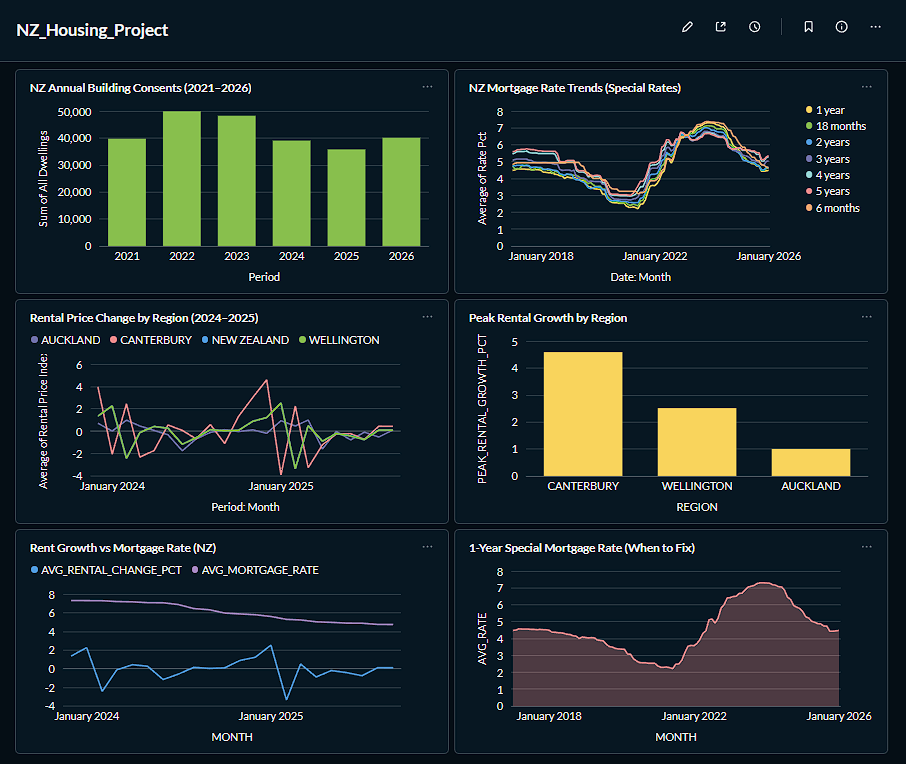

# 🏠 NZ Housing Market Analytics Pipeline

An end-to-end data engineering project that ingests, transforms, and analyses New Zealand housing market data to uncover trends in rental affordability, mortgage rates, and housing supply.



---

## 📌 Project Overview

New Zealand's housing market is one of the most discussed economic topics in the country. This project builds a production-style data pipeline that collects housing data from two public NZ sources, loads it into a cloud data warehouse, and transforms it into analytical models ready for reporting.

This project demonstrates core data engineering skills including batch ingestion, data modelling, ELT transformations with dbt, orchestration with Airflow, and data quality testing.

---

## 🎯 Objectives

- Build a scalable batch pipeline ingesting NZ housing data monthly
- Load raw data into Snowflake and transform it using dbt
- Apply data quality checks using dbt tests
- Orchestrate the pipeline end-to-end with Apache Airflow
- Deliver a unified affordability mart combining rental, mortgage, and supply data

---

## 🗂️ Data Sources

| # | Source | Data | Format | Frequency |
|---|---|---|---|---|
| 1 | Stats NZ | Building consents by dwelling type, HUD rental price index by region | XLSX | Monthly |
| 2 | Reserve Bank NZ (RBNZ) | Mortgage interest rates — special (B21), standard (B20), weighted avg (B30) | XLSX | Monthly |

> **Note:** All sources are aggregated to region + month grain before joining. Analysis is macro-level, not individual property level.

---

## 🏗️ Architecture

```
┌─────────────────────────────────────────────────┐
│                  DATA SOURCES                   │
│        Stats NZ XLSX       │     RBNZ XLSX      │
└────────┬───────────────────────────┬────────────┘
         │                            │
         ▼                            ▼
┌─────────────────────────────────────────────────┐
│           INGESTION LAYER (Python)              │
│          stats_nz.py   │   rbnz.py              │
└────────────────────────┬────────────────────────┘
                         │
                         ▼
┌─────────────────────────────────────────────────┐
│          DATA WAREHOUSE (Snowflake)             │
│   RAW schema → STAGING schema → MARTS schema    │
│     (Bronze)      (Silver)          (Gold)      │
└────────────────────────┬────────────────────────┘
                         │
                         ▼
┌─────────────────────────────────────────────────┐
│         TRANSFORMATION LAYER (dbt)              │
│        Staging models → Mart models             │
└────────────────────────┬────────────────────────┘
                         │
                         ▼
┌─────────────────────────────────────────────────┐
│        ORCHESTRATION (Apache Airflow)           │
│    Monthly DAG: Ingest → Load → Transform       │
└─────────────────────────────────────────────────┘
```

---

## 📊 Data Model

```
┌──────────────────────┐     ┌──────────────────────┐
│  stg_building_       │     │  stg_mortgage_rates  │
│  consents            │     │──────────────────────│
│──────────────────────│     │ rate_date            │
│ consent_year         │     │ term                 │
│ houses               │     │ rate_pct             │
│ apartments           │     │ series               │
│ townhouses           │     └──────────┬───────────┘
│ all_dwellings        │                │
└──────────┬───────────┘                │
           │                            │
           │      ┌─────────────────────┘
           │      │
           ▼      ▼
┌──────────────────────┐     ┌──────────────────────┐
│   stg_hud_rental     │     │                      │
│──────────────────────│     │  MART_AFFORDABILITY  │
│ region               │────▶│──────────────────────│
│ period               │     │ region               │
│ rental_price_index   │     │ period               │
│ annual_change_pct    │     │ rental_price_index   │
└──────────────────────┘     │ rental_annual_change │
                             │ one_year_special_rate│
                             │ affordability_index  │
                             │ annual_consents_*    │
                             │ supply_pressure      │
                             └──────────────────────┘
```

---

## 🔗 How The Sources Integrate

| Source | Role | Grain |
|---|---|---|
| Stats NZ (HUD rental) | Demand side — rental price trends by region | Region + monthly |
| Stats NZ (Building consents) | Supply side — how many homes are being built | National + yearly |
| RBNZ | Cost side — how much it costs to borrow | National + monthly |

**Key analytical outputs from `mart_affordability`:**
- **Affordability Index** — rental price index divided by 1-year mortgage rate
- **Supply Pressure** — high/moderate/low flag based on rental growth vs consent volumes
- **Rental Trends** — annual rental price change by region over time

---

## 🛠️ Tech Stack

| Layer | Tool |
|---|---|
| Language | Python 3.10+ |
| Data Warehouse | Snowflake |
| Transformation | dbt (dbt-snowflake) |
| Orchestration | Apache Airflow |
| Data Quality | dbt tests |
| Version Control | Git + GitHub |
| Containerisation | Docker |

---

## 📁 Project Structure

```
nz-housing-pipeline/
│
├── dags/                        # Airflow DAGs
│   └── housing_pipeline.py      # Main monthly pipeline DAG
│
├── ingestion/                   # Data ingestion scripts
│   ├── stats_nz.py              # Stats NZ building consents + HUD rental index
│   ├── rbnz.py                  # RBNZ mortgage rates (B20, B21, B30)
│   └── snowflake_loader.py      # Loads ingested data into Snowflake RAW schema
│
├── dbt_project/                 # dbt project
│   ├── models/
│   │   ├── staging/             # Raw → cleaned models
│   │   └── marts/               # Analytical mart models
│   ├── macros/
│   └── dbt_project.yml
│
├── data/                        # Local raw data (gitignored)
│   └── raw/
│       ├── stats_nz/
│       └── rbnz/
│
├── docker-compose.yml           # Airflow local setup
├── .env                         # Credentials (gitignored)
├── .gitignore
├── requirements.txt
└── README.md
```

---

## 📈 Analytical Outputs

- **Affordability Index** — rental price index vs current 1-year mortgage rate by region
- **Supply Pressure** — building consent volumes vs rental growth rate
- **Rental Trends** — annual rental price change by region over time

---

## 🙋 About

Built as a portfolio project to demonstrate data engineering skills relevant to the New Zealand job market. All data sources are publicly available.

---

## 📄 License

MIT License — feel free to fork and adapt for your own learning.
